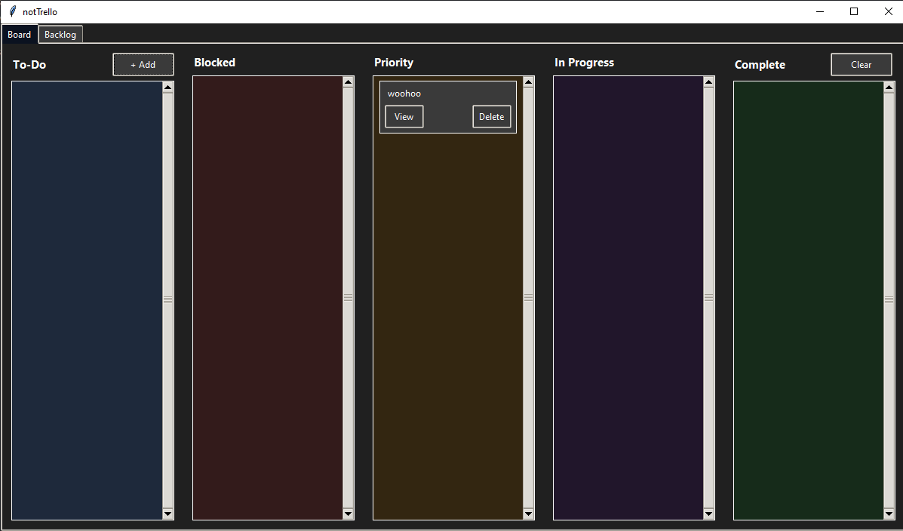
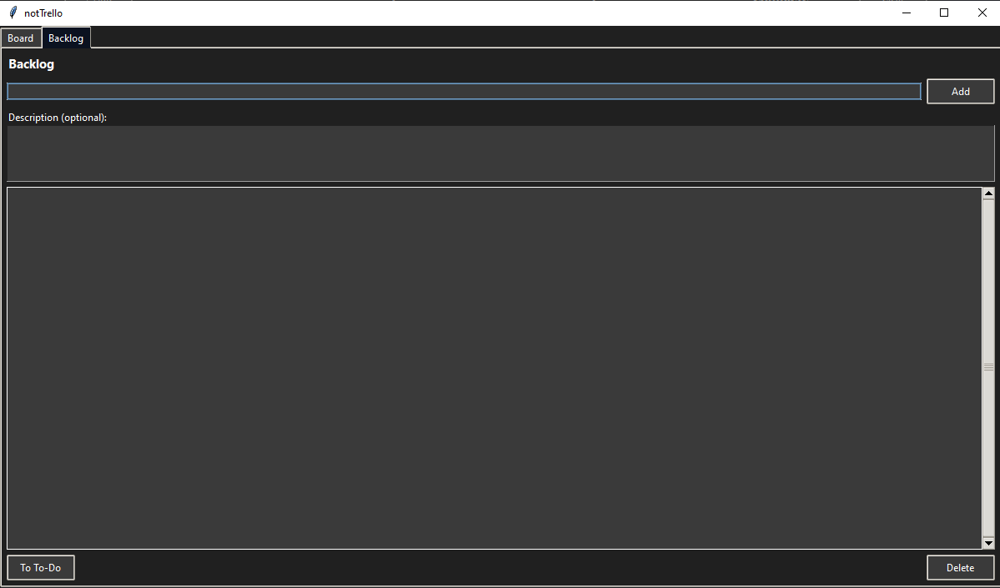
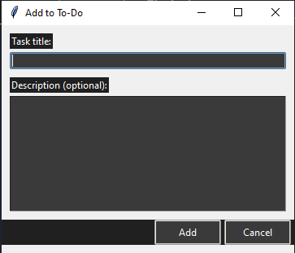
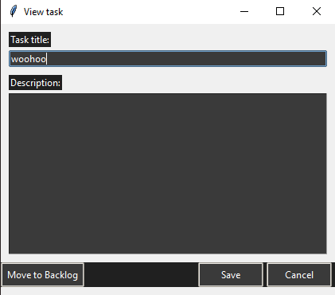

# notTrello

this was 99% gpt5 code using vscode copilot

please do not sue me atlassian i am not selling this i promise

just download and run the exe ig

Features:
- Five sections: To-Do, Blocked, Priority, In Progress, Complete
- Add and delete tasks
- Task descriptions
- Edit task names and descriptions
- Drag tasks between columns
- Backlog: add items and move them to and from To-Do
- Clear completed tasks

uses tkinter (if the gui design doesnt make this clear)

## Screenshots

	
	

